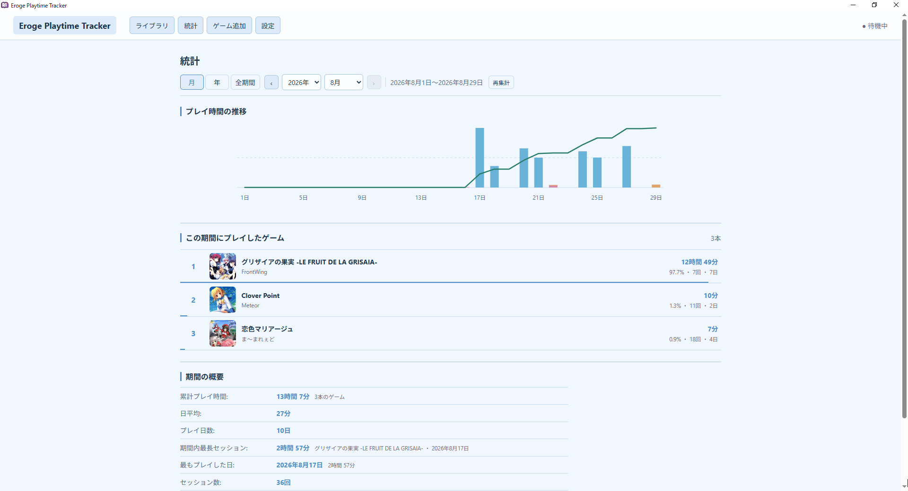

# Eroge Playtime Tracker

エロゲのプレイ時間を自動計測・記録するWindows向けアプリです。

[公式サイト](https://eroge-playtime-tracker.com/) |
[最新版をダウンロード](https://github.com/tinypark2010/ErogePlaytimeTracker/releases/latest)

## 主な機能

- 登録したゲームの起動
- ゲームごとのプレイ時間と起動履歴の記録
- 期間ごとのプレイ時間、ゲーム別内訳、推移グラフの確認
- バックグラウンド時間の自動除外
- ErogameScapeからのゲーム情報取得
- プレイ状況やタイムスタンプの管理
- ゲーム画面のスクリーンショット撮影と日本語テキストの文字起こし
- PC移行用のデータのエクスポート・インポート

## インストール

Windows 10 / 11（x64）に対応しています。

1. [Releases](https://github.com/tinypark2010/ErogePlaytimeTracker/releases/latest)から最新の`ErogePlaytimeTracker_*_x64-setup.exe`をダウンロードします。
2. ダウンロードしたファイルを実行してインストールします。

## 使い方

1. アプリを起動し、「ゲーム追加」を選びます。
2. ゲームの実行ファイルを選んで登録します。
3. ライブラリからゲームを起動すると、自動で記録が始まります。

計測中はEroge Playtime Trackerを起動しておく必要があります。設定からWindowsログイン時の自動起動を有効にできます。

プレイ履歴、ゲーム情報、スクリーンショットはPC内に保存されます。

スクリーンショットの拡大表示中は、画像の左右のボタンまたはキーボードの左右キーで、一覧のページをまたいで前後の画像へ移動できます。

スクリーンショットの文字起こしには端末内で動作するPaddleOCRを使用します。画像上をドラッグして認識範囲を絞ることもできます。文字起こし処理では画像や認識結果を外部へ送信せず、認識結果は保存しません。「Googleで検索」を押すと、認識結果の全文を検索語として既定のブラウザでGoogle検索を開きます。検索時だけ認識結果をGoogleへ送信します。

設定の「ゲーム画面のOCR検索キー」に撮影用とは別のキーを登録すると、スクリーンショットを保存せずにゲーム画面から直接検索できます。計測中のゲームを前面にしてキーを押し、調べたい文字をドラッグしてください。マウスを離すと選択範囲を端末内で文字起こしし、認識結果の全文でGoogle検索を開きます。文字を読み取れなかった場合は検索しません。Esc・右クリック、または別のウィンドウへ切り替えると中止します。画像・認識結果は保存せず、画像は外部へ送信しません。

範囲選択中はキーを押した時点の画像を表示しますが、ゲーム自体は一時停止しません。画面の取得や範囲選択ができないゲームでは、ウィンドウ／ボーダーレス表示をお試しください。排他的フルスクリーンなど、ゲームの描画方式によっては利用できない場合があります。

## データの移行

設定画面の「データの移行」から、ゲーム、プレイ履歴、設定、サムネイル、スクリーンショットを1つの`.eptbackup`ファイルへエクスポートできます。スクリーンショットだけを除外することもでき、処理中は進捗と処理済み容量を確認できます。移行先のPCでそのファイルをインポートしてください。

インポートは現在のデータへの追加ではなく、バックアップ内容による置き換えです。実行前に件数を比較でき、置き換える直前のデータも自動で退避されます。ゲーム本体はバックアップに含まれないため、移行先で実行ファイルの場所が変わったゲームは登録し直してください。バックアップ操作はゲームを計測していないときだけ実行できます。

## アップデート

アップデートは設定画面から実行できます。自動確認を有効にすると、アプリの起動時に新しいバージョンがあるか確認し、利用できる場合は通知します。

## その他

- [開発者向け情報](docs/technical-notes.md)

## スクリーンショット

### ライブラリ

### 統計

### ゲーム追加

### ゲーム詳細

### セッション履歴

### 計測中

### 設定

