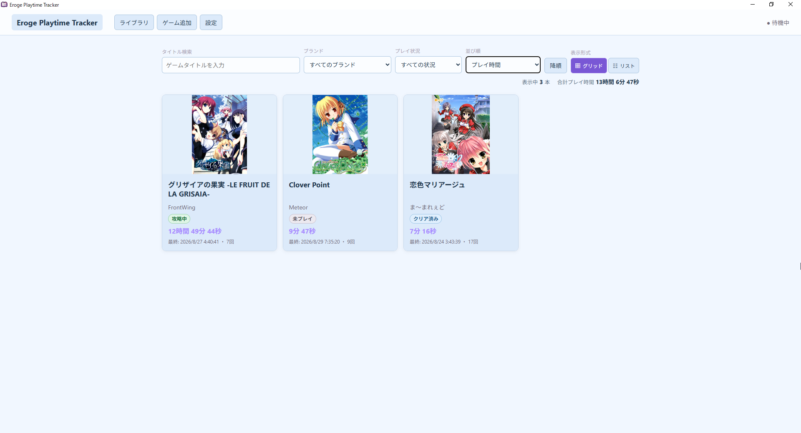
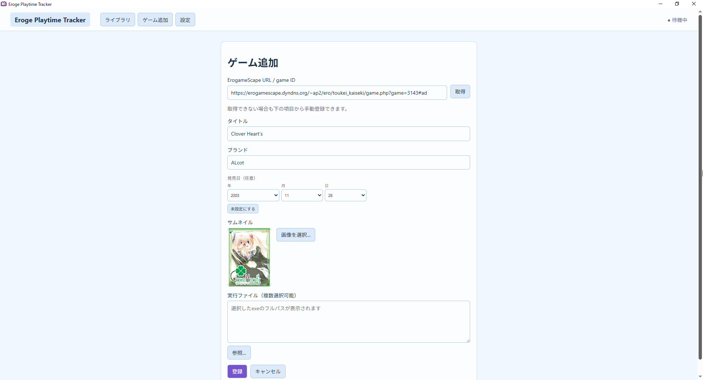
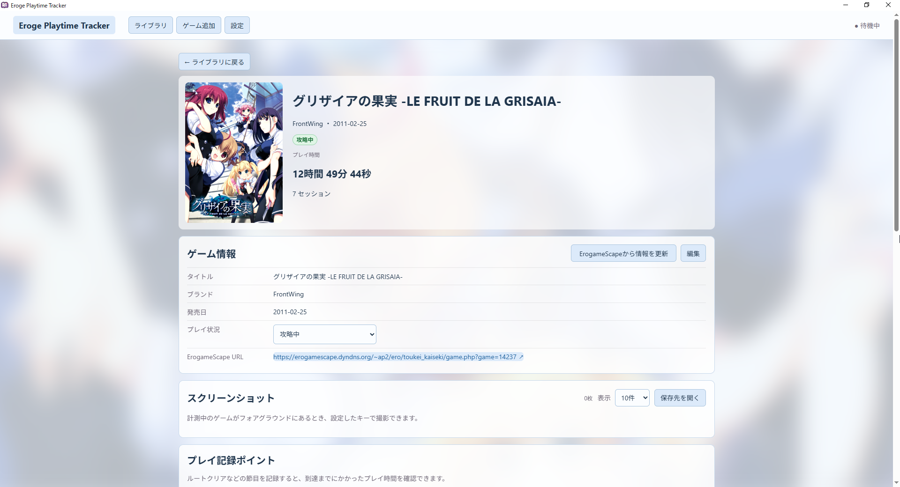
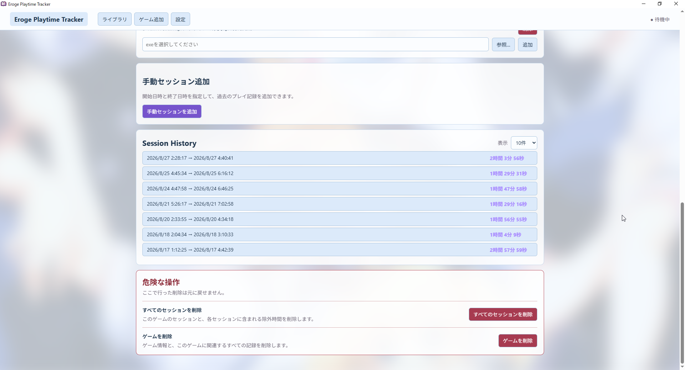
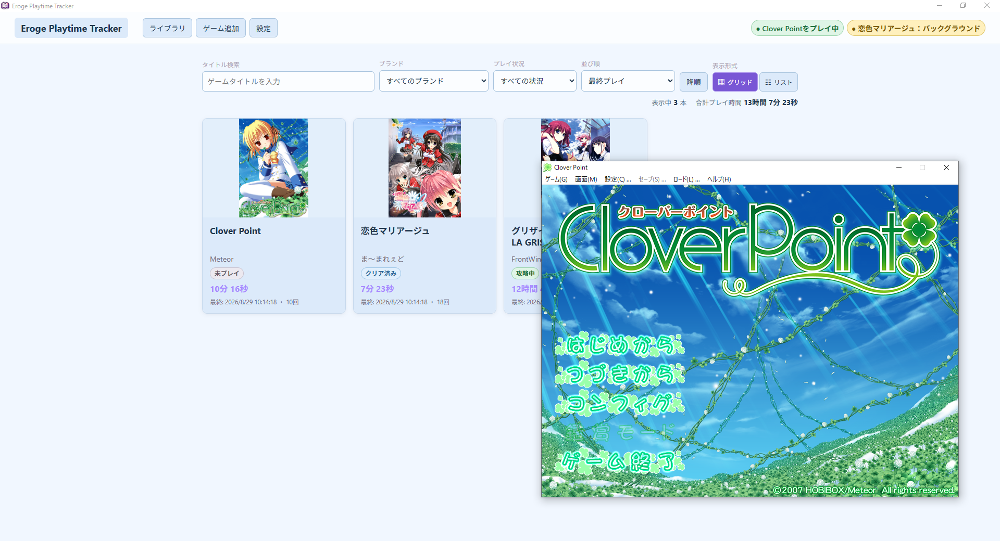
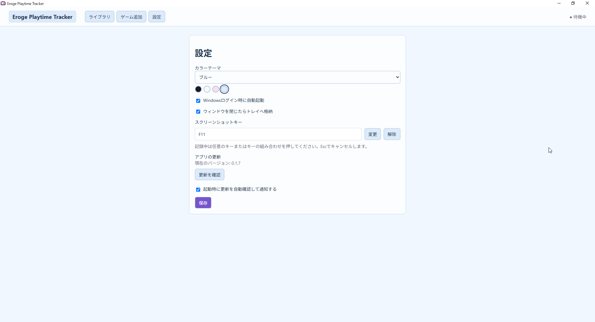

# Eroge Playtime Tracker

エロゲのプレイ時間を管理するツールです。

登録したゲームの起動を検出し、プレイ時間を記録します。

## 主な機能

- 登録したゲームの起動
- ゲームごとのプレイ時間と起動履歴の記録
- バックグラウンド時間の自動除外
- ErogameScapeからのゲーム情報取得
- プレイ状況や記録ポイントの管理
- ゲーム画面のスクリーンショット撮影

## インストール

Windows 10 / 11（x64）に対応しています。

1. [Releases](https://github.com/tinypark2010/ErogePlaytimeTracker/releases/latest)から最新の`ErogePlaytimeTracker_*_x64-setup.exe`をダウンロードします。
2. ダウンロードしたファイルを実行してインストールします。

## 使い方

1. アプリを起動し、「ゲーム追加」を選びます。
2. ゲームの実行ファイルを選んで登録します。
3. ライブラリからゲームを起動すると、自動で記録が始まります。

計測中はEroge Playtime Trackerを起動しておく必要があります。設定からWindowsログイン時の自動起動を有効にできます。

プレイ履歴、ゲーム情報、スクリーンショットはPC内に保存されます。

## アップデート

アップデートは設定画面から実行できます。自動確認を有効にすると、アプリの起動時に新しいバージョンがあるか確認し、利用できる場合は通知します。

## その他

- [開発者向け情報](docs/technical-notes.md)

## スクリーンショット

### ライブラリ

### ゲーム追加

### ゲーム詳細

### セッション履歴

### 計測中

### 設定

